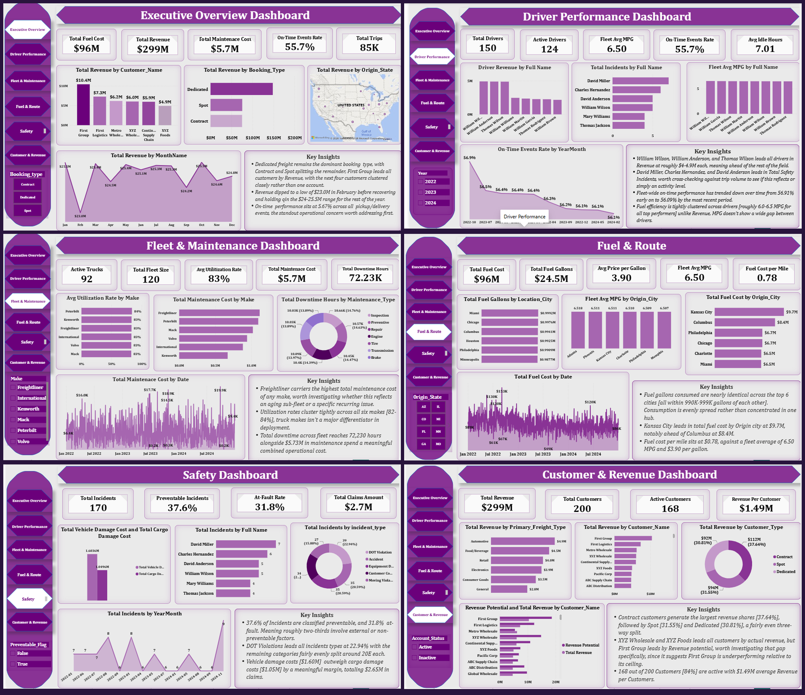

# Logistics & Transportation Analytics Dashboard

A comprehensive, multi-page business intelligence project 
built in Power BI, analysing the operations of a logistics 
and transportation company across six key domains.

---

## Project Overview

This capstone project simulates a real-world analytics 
use case for a logistics company. The goal was to transform 
raw operational data into actionable business insights 
through interactive dashboards and data visualisation.

---

## Dashboard Pages

### 1. Executive Overview
High-level summary of company-wide performance.
- Total Revenue: $299M
- Total Fuel Cost: $96M
- Total Maintenance Cost: $5.7M
- On-Time Events Rate: 55.7%
- Total Trips: 85K

### 2. Driver Performance
Analysis of 150 drivers across key performance metrics.
- Active Drivers: 124
- Fleet Avg MPG: 6.50
- Avg Idle Hours: 7.01
- On-Time Events Rate: 55.7%

### 3. Fleet & Maintenance
Operational health and cost analysis across 120 trucks.
- Active Trucks: 92
- Avg Utilisation Rate: 83%
- Total Maintenance Cost: $5.7M
- Total Downtime Hours: 72.23K

### 4. Fuel & Route
Fuel consumption and route efficiency by city and state.
- Total Fuel Cost: $96M
- Total Fuel Gallons: 24.5M
- Avg Price per Gallon: $3.90
- Fuel Cost per Mile: $0.78

### 5. Safety
Incident tracking and risk analysis across the fleet.
- Total Incidents: 170
- Preventable Incidents: 37.6%
- At-Fault Rate: 31.8%
- Total Claims Amount: $2.7M

### 6. Customer & Revenue
Customer segmentation and revenue performance analysis.
- Total Revenue: $299M
- Total Customers: 200
- Active Customers: 168
- Revenue Per Customer: $1.49M

---

## Dashboard Preview

---

## Tools & Technologies
- Power BI Desktop
- DAX (Data Analysis Expressions)
- Data Modelling
- Interactive Slicers & Filters

---

## File
- `Omolade Logistics Dashboard.pbix` — Full Power BI project file

---

## Author
**Oke Latifah Omolade**
Data Analyst | TS Academy
[LinkedIn](https://www.linkedin.com/posts/latifah-oke-8a1535387_powerbi-dataanalytics-capstoneproject-activity-7510314092918812673-NvRZ?utm_medium=ios_app&rcm=ACoAAF9MBbkB73IyKi_qFirfVHilRohCmtebR1k&utm_source=social_share_send&utm_campaign=copy_link)

---

## Key Insights
- Dedicated freight is the dominant booking type at 37.64%
  of total revenue
- On-time performance at 55.7% is the standout operational
  concern requiring immediate attention
- Kansas City leads all cities in total fuel cost at $9.7M
- Freightliner carries the highest maintenance cost of any
  truck make in the fleet
- 37.6% of all incidents are classified as preventable —
  a significant area for operational improvement
- First Group leads all customers by revenue potential
  but shows a gap against actual revenue worth investigating
